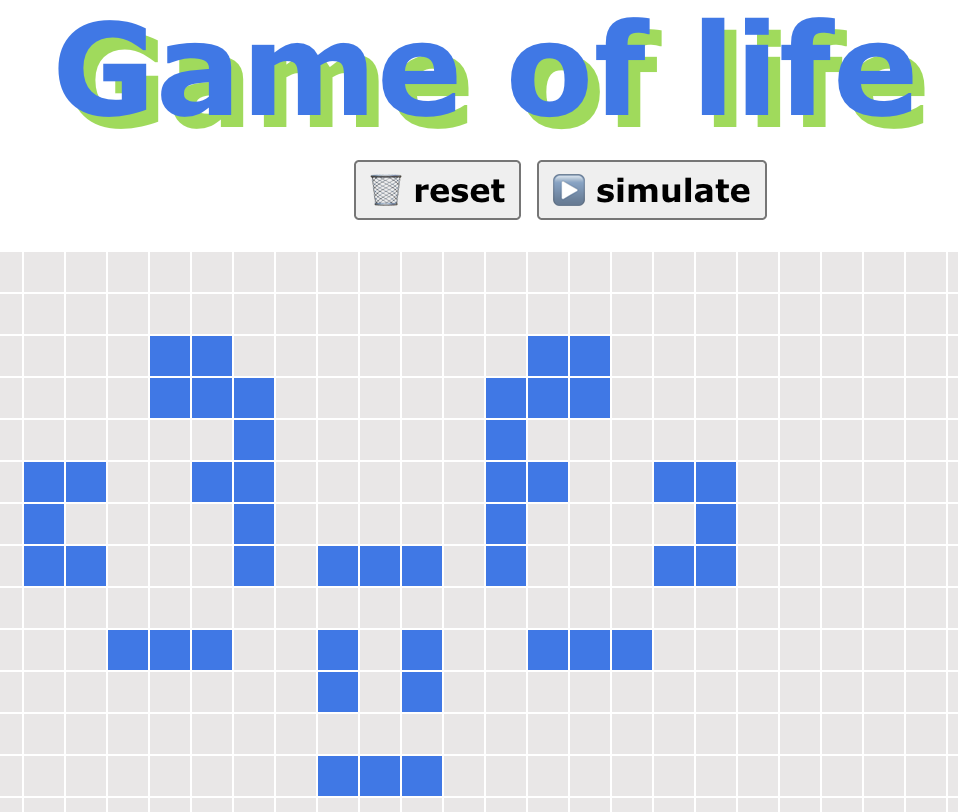

# Game of Life with Replicant


This project is an implementation of [Conway's Game of Life](https://en.wikipedia.org/wiki/Conway%27s_Game_of_Life) using [Replicant](https://replicant.fun/).It is largely based on patterns learned from the official [tic-tac-toe ](https://replicant.fun/tutorials/tic-tac-toe/) tutorial.


A live version can be found [here](https://supplyzone.github.io/replicant-gol/index.html) 👈




### How to run locally?

```bash
npm install 
npx shadow-cljs watch app
```
Afterwards open [localhost:8080](http://localhost:8080)


### disclaimer:

This PoC has neither been developed nor tested on mobile devices.